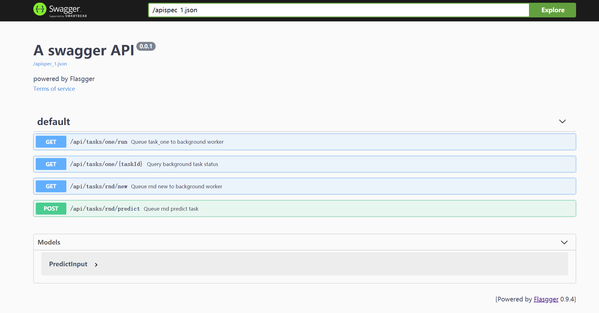
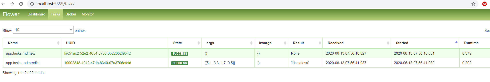

### Template using Flask + Redis + Celery, Celery Flower

Install docker,docker-compose

```
docker-compose up
```


open http://localhost:8000/ to see swagger docs




open http://localhost:5555/ to see celery status



steps

- try `GET ​/api​/tasks​/rnd​/new`  to generate model
- open http://localhost:5555/ to check out task status
- try `POST /api​/tasks​/rnd​/predict` with body
   ```
    {
        "data": [ 5.1, 3.3, 1.7, 0.5 ]
    }
   ```
- open http://localhost:5555/ to predict task status and predict results
